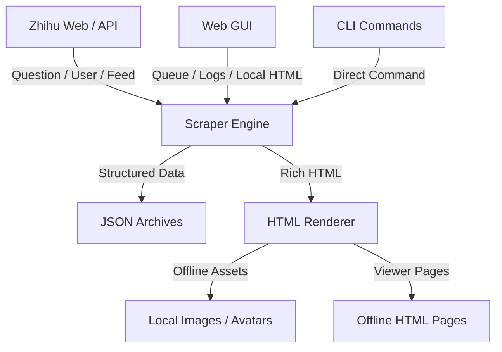

# ZhihuScraper 🚀

> 本地化的知乎内容归档与离线浏览工具

<div align="center">
  <h3>把问题回答、用户主页和热点内容沉淀成可检索、可离线查看的本地资料库</h3>
  <p>不仅仅是抓取数据，更是把分散在知乎上的内容整理成你自己的本地知识归档系统。</p>

  <p>
    
    
    
    
    
    
  </p>

  <p>
    <a href="#-核心能力">核心能力</a> •
    <a href="#-gui-功能总览">GUI 功能总览</a> •
    <a href="#-安装指南">安装指南</a> •
    <a href="#-快速开始">快速开始</a> •
    <a href="#-输出结构">输出结构</a> •
    <a href="#-测试">测试</a> •
    <a href="#-项目结构">项目结构</a>
  </p>
</div>

---

**ZhihuScraper** 是一个面向本地归档场景的知乎抓取工具，支持抓取：
- 问题下的回答列表与正文
- 用户主页下的回答、文章、想法
- 热榜与推荐流
- 本地 HTML 浏览页
- 离线图片与头像资源
- 单文件离线 HTML 导出

它提供 `GUI + CLI` 双入口，适合日常归档、批量采集、离线阅读和后续二次处理。  
相比单纯导出 JSON，这个项目更强调 **本地可读性、可离线浏览、抓取进度可视化、任务队列和后续整理能力**。

## ✨ 当前版本已具备

- GUI 可视化控制台
- CLI 命令行抓取入口
- 问题 / 用户 / 热榜 / 推荐流抓取
- 问题链接、回答链接、用户主页链接自动识别
- `full / text / fast` 三种导出模式
- `标准模式 / 保守模式` 两种抓取节奏
- `目录模式（HTML + assets）/ 单文件离线 HTML` 两种 HTML 导出方式
- 问题抓取分批保存与手动合并
- 本地已有 JSON 复用与重复抓取跳过
- 本地 HTML 浏览页生成
- 图片、头像本地化
- 懒加载图片 `src` 回填修正
- 问题页 / 用户页离线 HTML 中的原始链接
- 离线 HTML 页内本地搜索
- 每条回答 / 文章 / 想法的原始链接按钮
- 用户按内容类型局部强制重抓并与旧归档合并
- GUI 任务队列、删除、排序、去重
- 最近本地 HTML 搜索、打开、删除
- GUI 实时日志、日志文件保存、复制日志
- 任务完成后熄屏 / 休眠选项
- 离线 pytest 测试

## 🌟 核心能力

### 1. 🕷️ 问题全量归档

- **问题回答抓取**：优先走接口分页，减少单纯依赖页面滚动的丢失风险
- **分批保存**：大问题抓取过程中可持续写入 `question_batches`
- **自动合并**：抓完自动生成最终 JSON，也支持手动合并批次
- **本地浏览页**：按时间或点赞排序查看问题下全部内容
- **原始问题跳转**：离线 HTML 顶部可一键打开知乎原始问题

### 2. 👤 用户主页归档

- **多类型支持**：支持 `回答 / 文章 / 想法`
- **完整模式补正文**：列表抓完后逐条补正文
- **失败兜底**：接口失败时尝试页面提取
- **主页跳转**：离线 HTML 顶部可一键打开知乎原始主页

### 3. 💾 本地离线浏览

- **JSON 归档**：保留结构化数据，方便分析和后处理
- **HTML 浏览页**：更接近知乎阅读体验，而不是只看原始 JSON
- **目录模式**：生成 `HTML + assets`，适合日常归档
- **单文件模式**：生成一个可独立拷走的离线 HTML
- **离线资源下载**：完整模式下尽可能把图片和头像下载到本地
- **懒加载图片修正**：自动把知乎图片的真实地址回填到 `img src`
- **页内搜索**：离线 HTML 支持本地搜索作者、标题、摘要和正文关键词
- **原始链接按钮**：每条回答 / 文章 / 想法都可一键跳回知乎原文

### 4. 🧭 GUI 可视化操作

- **任务队列**：可批量加入多个问题或用户
- **自动串行执行**：一个接一个跑，不需要手动点开始
- **队列排序与删除**：支持上移、下移、删除待执行任务
- **重复任务跳过**：相同参数的任务不会重复入队
- **本地归档复用**：已有 JSON 时可跳过重复抓取，或只补 HTML
- **局部强制重抓**：用户页可只重抓 `回答 / 文章 / 想法` 其中一类，并保留本地未选中的旧类型
- **最近本地 HTML 管理**：支持搜索、打开、删除离线浏览页及本地图片
- **实时日志**：显示抓取阶段、正文补全、离线资源下载进度
- **日志文件落盘**：GUI 会话日志会保存到 `output/logs/`

## 🖥️ GUI 功能总览

当前 GUI 支持这些实际功能：

- `问题回答` 面板
  - 支持问题 ID、问题链接、回答链接
  - 支持多行批量输入，一行一个
  - 支持 `full / text / fast`
  - 支持 `标准模式 / 保守模式`
  - 支持 `目录模式 / 单文件离线 HTML`
  - 支持强制重抓

- `用户主页` 面板
  - 支持用户 token 或主页链接
  - 支持 `回答 / 文章 / 想法` 内容筛选
  - 支持 `full / text / fast`
  - 支持 `标准模式 / 保守模式`
  - 支持 `目录模式 / 单文件离线 HTML`
  - 支持强制重抓
  - 支持按勾选类型局部重抓并合并旧归档

- `快捷入口`
  - 热榜
  - 推荐流

- `任务队列`
  - 显示提交时间、开始时间、完成时间、实际耗时
  - 运行中显示最新阶段、最新进度、最新 ETA
  - 排队任务支持上移、下移、删除

- `实时日志`
  - 跟随日志开关
  - 手动滚动查看时不强制跳到底
  - 一键复制日志
  - 暂停 / 继续
  - 终止当前任务

- `最近本地 HTML`
  - 支持搜索
  - 支持直接打开浏览页
  - 支持删除离线 HTML 和其对应的本地图片资源
  - 删除为双确认交互

## 🧠 模式说明

### 内容模式

| 模式 | 说明 | 速度 | 完整度 |
|------|------|------|--------|
| `full` | 抓正文、生成 HTML、下载离线资源 | 慢 | 高 |
| `text` | 以 JSON 为主，保留文字内容 | 中 | 中 |
| `fast` | 更偏向快速拿列表结果和预览 | 快 | 相对较低 |

### 抓取节奏

| 节奏 | 说明 |
|------|------|
| `standard` | 默认模式，平衡速度和稳定性 |
| `conservative` | 请求间隔更大，更稳但更慢 |

### HTML 导出方式

| 模式 | 说明 |
|------|------|
| `dir` | 目录模式，输出 `HTML + assets/` |
| `single` | 单文件模式，把图片尽量内联到一个 HTML 中 |

## 🏗️ 系统架构



## 📦 安装指南

### 1. 基础环境

建议环境：
- Python 3.11+
- macOS / Linux / Windows
- 可正常安装 Playwright Chromium

### 2. 安装依赖

```bash
# Windows
python -m venv venv
.\venv\Scripts\pip install -r requirements.txt
.\venv\Scripts\playwright install chromium

# macOS / Linux
python3 -m venv venv
source venv/bin/activate
pip install -r requirements.txt
playwright install chromium
```

也可以直接使用 Makefile（如果你安装了 Make）：

```bash
make setup
```

### 3. 配置环境变量

复制模板：

```bash
cp .env.example .env
```

最常用配置如下：

```env
ZHIHU_COOKIE=你的知乎Cookie
REQUEST_DELAY_MIN=1
REQUEST_DELAY_MAX=2
BROWSER_DELAY_MIN=0.4
BROWSER_DELAY_MAX=0.8
REQUEST_TIMEOUT=30
QUESTION_BATCH_SIZE=50
```

完整可选项见 [.env.example](./.env.example)。

## 🍪 Cookie 获取步骤

很多知乎接口需要登录态，否则容易出现 `403`。  
推荐直接从浏览器开发者工具里复制完整 Cookie。

### 方式一：Chrome / Edge / Arc

1. 打开 [https://www.zhihu.com](https://www.zhihu.com) 并确认已经登录
2. 按 `F12` 打开开发者工具
3. 切换到 `Network`
4. 刷新当前页面
5. 点击任意一个 `zhihu.com` 请求
6. 在 `Request Headers` 里找到 `Cookie`
7. 复制完整内容，粘贴到 `.env`

写法：

```env
ZHIHU_COOKIE=这里粘贴完整Cookie
```

注意：
- 必须是一整行
- 不要只复制某一个 cookie 项
- Cookie 过期后需要重新复制
- 不要把真实 Cookie 提交到 GitHub

### 方式二：Safari

1. 打开 Safari 设置并启用“开发”菜单
2. 登录知乎并打开任意知乎页面
3. 打开网页检查器
4. 在 `网络` 面板刷新页面
5. 打开任意知乎请求
6. 在请求头里找到 `Cookie`
7. 复制完整内容到 `.env`

### 常见问题

**1. 填了 Cookie 还是 403**
- 先确认复制的是完整 Cookie 请求头
- 先确认当前知乎账号仍在登录态
- 重新登录知乎后再复制一次最新 Cookie

**2. GUI 会自动读取 `.env` 吗**
- 会
- 直接在项目根目录放 `.env` 即可

## 🚀 快速开始

### 方式一：GUI（推荐）

#### Windows
```powershell
.\venv\Scripts\python.exe gui.py
```

#### macOS / Linux
```bash
./venv/bin/python3 gui.py
```

> **提示**：如果 `8080` 端口被占用，程序会自动尝试下一个可用端口。
> 启动后，控制台会输出类似 `Starting server on http://localhost:8080` 的信息，直接在浏览器打开即可。

如果需要手动指定端口：

```bash
# Windows (PowerShell)
$env:GUI_PORT=8081; .\venv\Scripts\python.exe gui.py

# macOS / Linux
GUI_PORT=8081 ./venv/bin/python3 gui.py
```

### 方式二：CLI

#### 抓问题

```bash
venv/bin/python main.py question <问题ID或完整链接>
```

#### 抓用户主页

```bash
venv/bin/python main.py user <用户token或完整链接>
```

#### 抓热榜 / 推荐流

```bash
venv/bin/python main.py hot-list
venv/bin/python main.py recommend
```

#### 合并问题批次

```bash
venv/bin/python main.py merge-question <问题ID或完整链接>
```

## 🧩 CLI 用法

### 问题抓取

```bash
venv/bin/python main.py question <问题ID或链接> \
  --mode full \
  --profile standard \
  --html-variant dir
```

可选参数：
- `--mode {full,text,fast}`
- `--profile {standard,fast}`
- `--conservative`
- `--html-variant {dir,single}`
- `--force`

示例：

```bash
venv/bin/python main.py question 2009611085918013365 --mode full --html-variant single
venv/bin/python main.py question https://www.zhihu.com/question/35995881 --mode fast
venv/bin/python main.py question 2009611085918013365 --mode full --conservative
```

### 用户主页抓取

```bash
venv/bin/python main.py user <用户token或链接> \
  --mode full \
  --types answer article pin \
  --profile standard \
  --html-variant dir
```

可选参数：
- `--mode {full,text,fast}`
- `--types answer article pin`
- `--profile {standard,fast}`
- `--conservative`
- `--html-variant {dir,single}`
- `--force`

示例：

```bash
venv/bin/python main.py user ming--li --mode full --types answer article pin
venv/bin/python main.py user https://www.zhihu.com/people/ming--li --mode text --types answer
venv/bin/python main.py user ming--li --mode full --html-variant single --conservative
```

如果你只想重抓某一类内容，同时保留本地其他类型旧数据：

```bash
venv/bin/python main.py user ming--li --mode full --types pin --force
```

这会只重新抓 `pin`，并把旧归档里的 `answer/article` 保留下来后再合并保存。

## 🖱️ GUI 使用流程

### 问题抓取

1. 切到 `问题回答`
2. 输入问题 ID、问题链接或回答链接
3. 支持多行，一行一个
4. 选择导出模式、抓取策略和 HTML 导出方式
5. 点击 `加入队列`
6. 任务会自动开始，不需要再点“开始”

### 用户主页抓取

1. 切到 `用户主页`
2. 输入用户 token 或主页链接
3. 选择导出模式
4. 勾选 `回答 / 文章 / 想法`
5. 点击 `加入队列`

如果你只想重抓某一类：

1. 勾选要重抓的类型，例如只勾 `想法`
2. 打开 `强制重抓`
3. 运行后会仅替换该类型，并保留本地旧归档里未勾选的其他类型

### 最近本地 HTML

1. 在右侧 `最近本地 HTML` 搜索标题
2. 点击列表项选中
3. 点 `打开浏览页` 直接打开离线 HTML
4. 点 `删除 HTML + 图片` 可删除离线页面和对应本地资源

说明：
- 删除不会移除 JSON
- 删除需要二次确认

## 📁 输入支持

### 问题抓取支持

- 问题 ID  
  例如：`2009611085918013365`
- 问题链接  
  例如：`https://www.zhihu.com/question/2009611085918013365`
- 回答链接  
  例如：`https://www.zhihu.com/question/2009611085918013365/answer/123456789`

### 用户抓取支持

- 用户 `url_token`
- 用户主页完整链接  
  例如：`https://www.zhihu.com/people/ming--li`

## 📁 输出结构

```text
output/
├── questions/                         # 问题 JSON
├── users/                             # 用户 JSON
├── question_batches/                  # 问题分批保存文件
├── html/
│   ├── questions/                     # 问题 HTML 浏览页
│   ├── users/                         # 用户 HTML 浏览页
│   └── assets/                        # 本地离线图片与头像
├── logs/                              # GUI 会话日志
├── hot-list.json                      # 热榜结果
└── recommend.json                     # 推荐流结果
```

### 文件命名规则

- 问题 JSON 和 HTML 默认使用 **中文标题 + ID**
- 用户 JSON 和 HTML 默认使用 **用户名 + ID**
- 会自动做文件名安全处理，避免非法字符

例如：

```text
output/questions/普通人要-OpenClaw-有什么用-2009611085918013365.json
output/html/questions/普通人要-OpenClaw-有什么用-2009611085918013365.html
output/users/桑桑桑-ming--li.json
```

## 🧾 JSON 元信息

问题和用户归档的顶层都带有 `export_meta`，用于记录导出过程。

### 问题 `export_meta`

包含：
- `scraped_at`
- `source_type`
- `source_input`
- `question_id`
- `question_title`
- `content_mode`
- `crawl_profile`
- `html_variant`
- `answer_count_declared`
- `answer_count_fetched`
- `output_json`
- `output_html`

### 用户 `export_meta`

包含：
- `scraped_at`
- `source_type`
- `source_input`
- `user_id`
- `user_name`
- `content_mode`
- `content_types`
- `crawl_profile`
- `html_variant`
- `activity_count_fetched`
- `activity_title_preview`
- `output_json`
- `output_html`

## 📄 离线 HTML 特性

当前生成的离线 HTML 页面支持：

- 更接近知乎的内容流布局
- 头像展示
- 图片离线化
- 页内本地搜索
- 问题页按点赞 / 时间排序
- 用户页按点赞 / 时间排序
- 用户页按 `回答 / 文章 / 想法` 筛选
- 顶部原始问题 / 原始用户主页链接
- 每条回答 / 文章 / 想法的原始链接按钮
- 想法转发内容至少保留一个原始转发链接
- 目录模式或单文件模式导出

## 🧪 测试

项目带了一套**完全离线**的基础测试，优先覆盖这些稳定逻辑：
- 链接 / ID 归一化
- 中文标题文件命名
- JSON 存储与批次合并
- HTML 渲染输出
- 问题 / 用户接口数据解析

### 1. 安装测试依赖

如果你已经执行过：

```bash
venv/bin/pip install -r requirements.txt
```

那 `pytest` 也已经装好了。

### 2. 运行全部测试

```bash
make test
```

或者：

```bash
venv/bin/python -m pytest -q
```

### 3. 只运行某一类测试

例如只跑链接识别测试：

```bash
venv/bin/python -m pytest tests/test_input_normalizer.py -q
```

只跑渲染测试：

```bash
venv/bin/python -m pytest tests/test_renderers.py -q
```

### 4. 一个最短样例

```bash
venv/bin/python -m pytest tests/test_input_normalizer.py -q
```

这会验证：
- 问题 ID
- 问题链接
- 回答链接
- 用户主页链接

### 5. 测试文件位置

```text
tests/
├── conftest.py
├── test_input_normalizer.py
├── test_export_utils.py
├── test_storage.py
├── test_renderers.py
└── test_scraper_parsing.py
```

说明：
- 默认**不访问真实知乎**
- 默认**不依赖真实 Cookie**
- 更适合本地开发和 CI

## 🧱 项目结构

```text
/
├── gui.py                    <-- [GUI] 本地图形界面入口
├── main.py                   <-- [CLI] 命令行入口
├── config.py                 <-- [Config] 运行参数与环境变量
├── models.py                 <-- [Model] 数据模型
├── storage.py                <-- [Storage] JSON 存储与批次合并
├── renderers.py              <-- [Renderer] 本地 HTML 渲染与离线资源处理
├── export_utils.py           <-- [Tool] 文件命名、导出元信息、时间估算
├── input_normalizer.py       <-- [Tool] 链接 / ID 归一化
├── system_actions.py         <-- [Tool] 任务完成后的系统动作
├── requirements.txt          <-- 依赖列表
├── Makefile                  <-- 常用开发命令
├── .env.example              <-- 环境变量模板
├── tests/                    <-- 离线 pytest 测试
├── scraper/
│   ├── base.py               # 通用请求、重试、限速
│   ├── question.py           # 问题抓取逻辑
│   ├── user.py               # 用户抓取逻辑
│   └── feed.py               # 热榜 / 推荐流抓取
└── output/                   <-- 本地输出目录（默认忽略，不提交）
```

## 🛠️ 开发辅助

### 一键初始化

```bash
make setup
```

### 启动 GUI

```bash
make gui
```

### 查看 CLI 帮助

```bash
make help
```

### 静态编译检查

```bash
make lint
```

### 运行测试

```bash
make test
```

## ⚙️ 使用建议

- `full` 模式最完整，但会明显更慢
- `fast` 模式适合先摸底、先看规模
- `single` 单文件模式更方便拷走，但 HTML 会更大
- `conservative` 更稳，适合大问题、大用户或长时间抓取
- 若本地已有归档，默认会优先复用，减少重复抓取

## ⚠️ 注意事项

- 真实抓取依赖知乎当前页面结构和接口行为，网站变动后可能需要调整
- 很多接口依赖登录态 Cookie
- 批量抓取时建议优先使用标准或保守模式，避免节奏过激
- 本项目默认面向**个人归档 / 本地阅读**场景

## 📄 License

本项目采用 [MIT License](./LICENSE)。

---

Copyright © 2026 ZhihuScraper
