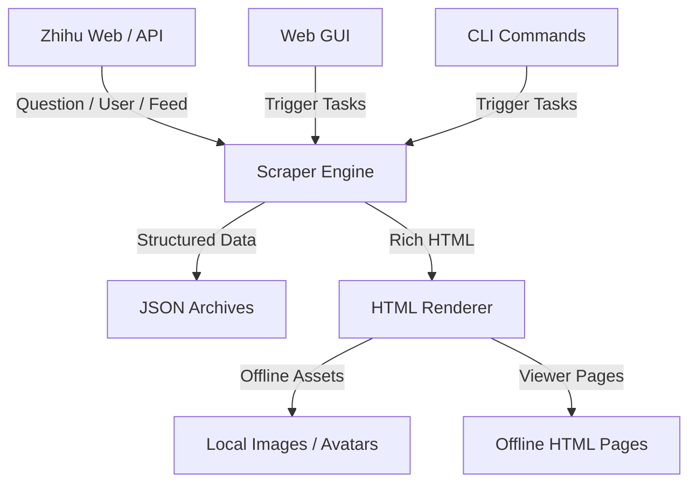

# ZhihuScraper 🚀

> 本地化的知乎内容归档与离线浏览工具

<div align="center">
  <h3>把问题回答、用户主页和热点内容沉淀成可检索、可离线查看的本地资料库</h3>
  <p>不仅仅是抓取数据，更是把分散在知乎上的内容整理成你自己的本地知识归档系统。</p>

  <p>
    
    
    
    
    
    
  </p>

  <p>
    <a href="#-核心功能">核心功能</a> •
    <a href="#-系统架构">系统架构</a> •
    <a href="#-安装指南">安装指南</a> •
    <a href="#-快速开始">快速开始</a> •
    <a href="#-项目结构">项目结构</a>
  </p>
</div>

---

**ZhihuScraper** 是一个面向本地归档场景的知乎抓取工具，支持抓取：
- 问题下的回答列表与正文
- 用户主页下的回答、文章、想法
- 热榜与推荐流
- 本地 HTML 浏览页
- 可选离线图片与头像资源

它提供 `GUI + CLI` 双入口，既适合日常手动归档，也适合按任务批量导出。  
相比单纯导出 JSON，这个项目更强调 **本地可读性、可离线浏览、抓取进度可视化和后续整理能力**。

## ✨ 新特性

当前版本已经支持：

- 可视化 GUI 控制台
- 问题与用户主页双抓取入口
- 用户内容类型筛选：`回答 / 文章 / 想法`
- `纯文字 JSON / 完整内容（HTML/图片）` 两种导出模式
- 问题抓取分批保存与合并
- 问题/用户本地 HTML 浏览页生成
- 离线图片与头像资源下载
- 保守模式，降低抓取强度
- 自动识别问题链接、回答链接、用户主页链接

## 🌟 核心功能

### 1. 🕷️ 问题全量归档
* **问题回答抓取**：按分页抓取问题下回答，避免单纯依赖页面滚动
* **批次保存**：大问题可按批次落盘，降低中断损失
* **本地浏览页**：抓取完成后自动生成 HTML，可按时间或点赞排序查看

### 2. 👤 用户主页归档
* **多类型支持**：支持 `回答 / 文章 / 想法`
* **正文补全**：完整模式下逐条补正文内容
* **失败兜底**：接口失败时会尝试页面提取

### 3. 💾 本地离线浏览
* **JSON 归档**：保留结构化数据，便于后续分析
* **HTML 浏览页**：更接近内容阅读场景，而不是只看原始 JSON
* **离线资源下载**：完整模式下会尽可能把图片和头像下载到本地

### 4. 🧭 GUI 可视化操作
* **图形化发起任务**：无需手输复杂命令
* **实时日志**：可观察抓取、补正文、下载离线资源等阶段
* **本地浏览页直达**：抓完后可直接点击打开 HTML

## 🏗️ 系统架构



## 📦 安装指南

### 1. 基础环境

建议环境：
- Python 3.11+
- macOS / Linux
- 可正常安装 Playwright Chromium

### 2. 安装依赖

```bash
python3 -m venv venv
venv/bin/pip install -r requirements.txt
venv/bin/playwright install chromium
```

也可以直接使用：

```bash
make setup
```

### 3. 配置环境变量

复制模板：

```bash
cp .env.example .env
```

在 `.env` 中填写：

```env
ZHIHU_COOKIE=你的知乎Cookie
REQUEST_DELAY_MIN=1
REQUEST_DELAY_MAX=2
REQUEST_TIMEOUT=30
QUESTION_BATCH_SIZE=50
```

完整可选配置见 [.env.example](./.env.example)。

## 🚀 快速开始

### 方式一：GUI（推荐）

```bash
venv/bin/python gui.py
```

然后打开终端中显示的地址。  
支持：
- 问题抓取
- 用户主页抓取
- 内容类型筛选
- 保守模式
- 实时日志
- 本地浏览页跳转

### 方式二：命令行

**抓问题：**

```bash
venv/bin/python main.py question <问题ID或完整链接>
```

**抓用户主页：**

```bash
venv/bin/python main.py user <用户token或完整链接>
```

**热榜与推荐流：**

```bash
venv/bin/python main.py hot-list
venv/bin/python main.py recommend
```

**更稳的保守模式：**

```bash
venv/bin/python main.py question <问题ID> --mode full --conservative
venv/bin/python main.py user <用户token> --mode full --types answer article pin --conservative
```

## 🧩 使用方式

### 问题抓取支持输入

- 问题 ID  
  例如：`2009611085918013365`
- 问题链接  
  例如：`https://www.zhihu.com/question/2009611085918013365`
- 回答链接  
  例如：`https://www.zhihu.com/question/2009611085918013365/answer/123456789`

### 用户抓取支持输入

- 用户 `url_token`
- 用户主页完整链接  
  例如：`https://www.zhihu.com/people/ming--li`

## 📁 输出结构

```text
output/
├── questions/                 # 问题 JSON
├── users/                     # 用户 JSON
├── question_batches/          # 问题分批保存文件
├── html/
│   ├── questions/             # 问题 HTML 浏览页
│   ├── users/                 # 用户 HTML 浏览页
│   └── assets/                # 本地离线图片与头像
├── hot-list.json              # 热榜结果
└── recommend.json             # 推荐流结果
```

说明：
- `text` 模式更快，输出更轻
- `full` 模式更完整，会补正文、生成浏览页，并尽可能下载离线资源

## 🧱 项目结构

```text
/
├── gui.py                    <-- [GUI] 本地图形界面入口
├── main.py                   <-- [CLI] 命令行入口
├── config.py                 <-- [Config] 运行参数与环境变量
├── models.py                 <-- [Model] 数据模型
├── storage.py                <-- [Storage] JSON 存储与批次合并
├── renderers.py              <-- [Renderer] 本地 HTML 渲染与离线资源处理
├── input_normalizer.py       <-- [Tool] 链接 / ID 归一化
├── requirements.txt          <-- 依赖列表
├── Makefile                  <-- 常用开发命令
├── .env.example              <-- 环境变量模板
├── scraper/
│   ├── base.py               # 通用请求、重试、限速
│   ├── question.py           # 问题抓取逻辑
│   ├── user.py               # 用户抓取逻辑
│   └── feed.py               # 热榜 / 推荐流抓取
└── output/                   <-- 本地输出目录（默认忽略，不提交）
```

## ⚙️ 公开仓库建议

这个项目当前更适合以 **源码仓库 + 本地运行说明** 的方式公开，而不是默认提供 Docker。

原因：
- 本地 GUI 与浏览器行为更适合在宿主机直接运行
- Playwright 浏览器安装与本地 Cookie 配置在宿主机更直接
- 对多数用户来说，`venv + requirements.txt` 上手成本更低

当前仓库默认忽略：
- `.env`
- `output/`
- `venv/`
- 各类缓存和本地私有配置

## 🛠️ 开发辅助

### 一键初始化

```bash
make setup
```

### 启动 GUI

```bash
make gui
```

### 查看 CLI 帮助

```bash
make help
```

### 静态编译检查

```bash
make lint
```

## 📝 当前版本说明

- **v0.1.0**：
  - 支持问题回答抓取
  - 支持用户主页内容抓取
  - 支持用户内容类型筛选
  - 支持 JSON / HTML 双输出
  - 支持离线资源下载
  - 支持保守模式
  - 支持 GUI 与 CLI 双入口

## 📄 License

本项目采用 [MIT License](./LICENSE)。

---

Copyright © 2026 ZhihuScraper
