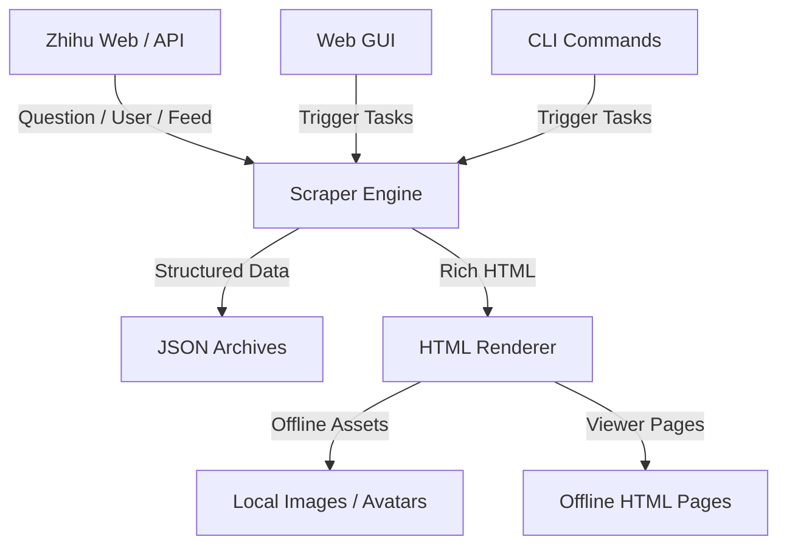

# ZhihuScraper 🚀

> 本地化的知乎内容归档与离线浏览工具

把问题回答、用户主页和热点内容沉淀成可检索、可离线查看的本地资料库。不仅仅是抓取数据，更是把分散在知乎上的内容整理成你自己的本地知识归档系统。

[]()
[]()
[]()
[]()
[]()
[]()

---

## 📋 目录

- [✨ 新特性](#-新特性)
- [🌟 核心功能](#🌟-核心功能)
- [🏗️ 系统架构](#🏗️-系统架构)
- [📦 安装指南](#📦-安装指南)
- [🍪 Cookie 获取步骤](#🍪-cookie-获取步骤)
- [🚀 快速开始](#🚀-快速开始)
- [🚨 常见问题](#🚨-常见问题)
- [🧩 使用方式](#🧩-使用方式)
- [📁 输出结构](#📁-输出结构)
- [🧱 项目结构](#🧱-项目结构)
- [⚙️ 公开仓库建议](#⚙️-公开仓库建议)
- [🛠️ 开发辅助](#🛠️-开发辅助)
- [📝 当前版本说明](#📝-当前版本说明)
- [📄 License](#📄-license)

---

## 简介

**ZhihuScraper** 是一个面向本地归档场景的知乎抓取工具，支持抓取：

- 问题下的回答列表与正文
- 用户主页下的回答、文章、想法
- 热榜与推荐流
- 本地 HTML 浏览页
- 可选离线图片与头像资源

它提供 `GUI + CLI` 双入口，既适合日常手动归档，也适合按任务批量导出。  
相比单纯导出 JSON，这个项目更强调 **本地可读性、可离线浏览、抓取进度可视化和后续整理能力**。

---

## ✨ 新特性

当前版本已经支持：

- 可视化 GUI 控制台
- 问题与用户主页双抓取入口
- 用户内容类型筛选：`回答 / 文章 / 想法`
- `纯文字 JSON / 完整内容（HTML/图片）` 两种导出模式
- 问题抓取分批保存与合并
- 问题/用户本地 HTML 浏览页生成
- 离线图片与头像资源下载
- 保守模式，降低抓取强度
- 自动识别问题链接、回答链接、用户主页链接

---

## 🌟 核心功能

### 1. 🕷️ 问题全量归档

- **问题回答抓取**：按分页抓取问题下回答，避免单纯依赖页面滚动
- **批次保存**：大问题可按批次落盘，降低中断损失
- **本地浏览页**：抓取完成后自动生成 HTML，可按时间或点赞排序查看

### 2. 👤 用户主页归档

- **多类型支持**：支持 `回答 / 文章 / 想法`
- **正文补全**：完整模式下逐条补正文内容
- **失败兜底**：接口失败时会尝试页面提取

### 3. 💾 本地离线浏览

- **JSON 归档**：保留结构化数据，便于后续分析
- **HTML 浏览页**：更接近内容阅读场景，而不是只看原始 JSON
- **离线资源下载**：完整模式下会尽可能把图片和头像下载到本地

### 4. 🧭 GUI 可视化操作

- **图形化发起任务**：无需手输复杂命令
- **实时日志**：可观察抓取、补正文、下载离线资源等阶段
- **本地浏览页直达**：抓完后可直接点击打开 HTML

---

## 🏗️ 系统架构



---

## 📦 安装指南

### 1. 基础环境

建议环境：

- Python 3.11+
- macOS / Linux
- 可正常安装 Playwright Chromium

### 2. 安装依赖

```bash
python3 -m venv venv
venv/bin/pip install -r requirements.txt
venv/bin/playwright install chromium
```

也可以直接使用：

```bash
make setup
```

### 3. 配置环境变量

复制模板：

```bash
cp .env.example .env
```

在 `.env` 中填写：

```env
ZHIHU_COOKIE=你的知乎Cookie
REQUEST_DELAY_MIN=1
REQUEST_DELAY_MAX=2
REQUEST_TIMEOUT=30
QUESTION_BATCH_SIZE=50
```

完整可选配置见 [.env.example](./.env.example)。

---

## 🍪 Cookie 获取步骤

> ⚠️ 很多知乎接口需要登录态，否则容易出现 `403`。推荐直接从浏览器开发者工具里复制完整 Cookie。

### 方式一：Chrome / Edge / Arc

1. 打开 [https://www.zhihu.com](https://www.zhihu.com) 并确认已经登录
2. 按 `F12` 打开开发者工具
3. 切换到 `Network` 面板
4. 刷新当前页面
5. 在请求列表里随便点开一个 `zhihu.com` 的请求
6. 在右侧找到 `Request Headers`
7. 找到 `Cookie` 字段
8. 复制整段 Cookie，粘贴到 `.env` 里的 `ZHIHU_COOKIE=这里粘贴完整Cookie`

> **注意：**
> - 必须是一整行，不要手动换行
> - 不要只复制某一个 cookie 项，要复制完整 `Cookie` 请求头内容
> - Cookie 过期后需要重新登录知乎并重新复制

### 方式二：Safari

1. 打开 Safari 设置，启用"开发"菜单
2. 登录知乎后打开任意知乎页面
3. 点击顶部"开发"菜单，打开网页检查器
4. 在 `网络` 面板刷新页面
5. 选择任意知乎请求
6. 在请求头里找到 `Cookie`
7. 复制完整内容到 `.env`

---

## 🚨 常见问题

> ⚠️ 如果你是 Windows 用户，或在安装 Playwright / 获取 Cookie 时遇到问题，请先阅读本节

### 1. Windows 用户运行 GUI 报错

如果你看到文档中的：

```bash
venv/bin/python gui.py
```

这是 macOS / Linux 的写法。

**在 Windows 上应使用：**

```bash
python gui.py
```

或（未激活虚拟环境时）：

```bash
.\venv\Scripts\python gui.py
```

### 2. Playwright 安装卡住（下载 Chromium 进度为 0%）

如果执行：

```bash
python -m playwright install chromium
```

出现长时间 `0%` 无响应，说明下载未正常进行。

**解决方法：**

1. 使用代理（推荐）
2. 开启全局模式或 TUN 模式
3. 推荐节点：日本 / 新加坡
4. 或在当前终端手动设置代理：

```powershell
$env:HTTP_PROXY="http://127.0.0.1:7890"
$env:HTTPS_PROXY="http://127.0.0.1:7890"
```

### 3. 使用国内镜像报错（404 / NoSuchKey）

如果你尝试使用：

```powershell
$env:PLAYWRIGHT_DOWNLOAD_HOST="https://npmmirror.com/mirrors/playwright"
```

但出现 `NoSuchKey` 错误，说明：

> 镜像未同步当前 Playwright 版本所需的 Chromium

**解决方法：**

```powershell
Remove-Item Env:PLAYWRIGHT_DOWNLOAD_HOST -ErrorAction SilentlyContinue
python -m playwright install chromium
```

并配合代理使用官方源下载。

### 4. 推荐安装方式（Windows）

完整推荐流程：

```powershell
cd E:\Project\ZhihuScraper
python -m venv venv
.\venv\Scripts\Activate.ps1
pip install -r requirements.txt
python -m playwright install chromium
python gui.py
```

### 5. 明明填了 Cookie，还是 403

先确认以下事项：

1. Cookie 是完整复制的（不是单个 cookie 项）
2. 知乎当前账号仍处于登录状态
3. 如果刚登录过久，重新复制一遍最新 Cookie

### 6. 可以把 Cookie 提交到 GitHub 吗

不可以。`.env` 已经默认被 `.gitignore` 忽略，**不要把真实 Cookie 上传到公开仓库**。

### 7. GUI 会自动读取 `.env` 吗

会。直接在项目根目录放置 `.env` 后，启动 `gui.py` 就会自动读取。

---

## 🚀 快速开始

### 方式一：GUI（推荐）

```bash
venv/bin/python gui.py
```

然后打开终端中显示的地址。支持：

- 问题抓取
- 用户主页抓取
- 内容类型筛选
- 保守模式
- 实时日志
- 本地浏览页跳转

### 方式二：命令行

**抓问题：**

```bash
venv/bin/python main.py question <问题ID或完整链接>
```

**抓用户主页：**

```bash
venv/bin/python main.py user <用户token或完整链接>
```

**热榜与推荐流：**

```bash
venv/bin/python main.py hot-list
venv/bin/python main.py recommend
```

**更稳的保守模式：**

```bash
venv/bin/python main.py question <问题ID> --mode full --conservative
venv/bin/python main.py user <用户token> --mode full --types answer article pin --conservative
```

---

## 🧩 使用方式

### 问题抓取支持输入

| 类型 | 示例 |
|------|------|
| 问题 ID | `2009611085918013365` |
| 问题链接 | `https://www.zhihu.com/question/2009611085918013365` |
| 回答链接 | `https://www.zhihu.com/question/2009611085918013365/answer/123456789` |

### 用户抓取支持输入

| 类型 | 示例 |
|------|------|
| 用户 `url_token` | `ming--li` |
| 用户主页完整链接 | `https://www.zhihu.com/people/ming--li` |

---

## 📁 输出结构

```text
output/
├── questions/                 # 问题 JSON
├── users/                     # 用户 JSON
├── question_batches/          # 问题分批保存文件
├── html/
│   ├── questions/             # 问题 HTML 浏览页
│   ├── users/                 # 用户 HTML 浏览页
│   └── assets/                # 本地离线图片与头像
├── hot-list.json              # 热榜结果
└── recommend.json             # 推荐流结果
```

> **说明：**
> - `text` 模式更快，输出更轻
> - `full` 模式更完整，会补正文、生成浏览页，并尽可能下载离线资源

---

## 🧱 项目结构

```text
/
├── gui.py                    <-- [GUI] 本地图形界面入口
├── main.py                   <-- [CLI] 命令行入口
├── config.py                 <-- [Config] 运行参数与环境变量
├── models.py                 <-- [Model] 数据模型
├── storage.py                <-- [Storage] JSON 存储与批次合并
├── renderers.py              <-- [Renderer] 本地 HTML 渲染与离线资源处理
├── input_normalizer.py       <-- [Tool] 链接 / ID 归一化
├── requirements.txt          <-- 依赖列表
├── Makefile                  <-- 常用开发命令
├── .env.example              <-- 环境变量模板
├── scraper/
│   ├── base.py               # 通用请求、重试、限速
│   ├── question.py           # 问题抓取逻辑
│   ├── user.py               # 用户抓取逻辑
│   └── feed.py               # 热榜 / 推荐流抓取
└── output/                   <-- 本地输出目录（默认忽略，不提交）
```


## 🛠️ 开发辅助

| 命令 | 说明 |
|------|------|
| `make setup` | 一键初始化 |
| `make gui` | 启动 GUI |
| `make help` | 查看 CLI 帮助 |
| `make lint` | 静态编译检查 |

---

## 📝 当前版本说明

### v0.1.0

- ✅ 支持问题回答抓取
- ✅ 支持用户主页内容抓取
- ✅ 支持用户内容类型筛选
- ✅ 支持 JSON / HTML 双输出
- ✅ 支持离线资源下载
- ✅ 支持保守模式
- ✅ 支持 GUI 与 CLI 双入口

---

## 📄 License

本项目采用 [MIT License](./LICENSE)。

---

Copyright © 2026 ZhihuScraper
