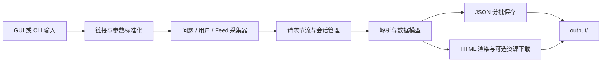

# ZhihuScraper

<div align="center">
  <p><strong>面向个人研究与离线归档的知乎内容采集工具。</strong></p>
  <p>
    
    
    
    <a href="./LICENSE"></a>
  </p>
  <p>
    <a href="#快速开始">快速开始</a> ·
    <a href="#支持的内容">能力</a> ·
    <a href="#命令行用法">CLI</a> ·
    <a href="#使用边界">使用边界</a>
  </p>
</div>

> 项目当前提供本地 GUI 与 CLI，可归档问题、用户内容、热榜和推荐流。平台接口和页面结构可能变化，因此任何抓取结果都需要人工抽查。

## 项目定位

ZhihuScraper 将采集、恢复、结构化保存和离线阅读放在同一条本地工作流中。它适合保存自己有权访问的公开内容、建立个人研究语料，或对少量目标进行可复核的数据整理。

这不是绕过访问控制的工具，也不保证无限量、无人值守或永久兼容。

## 支持的内容

| 类型 | 输入 | 主要输出 |
| --- | --- | --- |
| 问题 | 问题 ID 或完整链接 | 问题信息、回答批次、JSON 与可选 HTML |
| 用户 | 用户 ID、`url_token` 或完整链接 | 用户资料及选定内容类型 |
| 热榜 | 条数限制 | 当前热榜的结构化数据 |
| 推荐流 | 页码与每页数量 | 推荐条目的结构化数据 |

采集流程还包括：

- GUI 任务创建、队列状态和运行日志；
- 已有归档复用与 `--force` 强制刷新；
- 分批保存，降低长任务中断造成的数据损失；
- `full`、`text`、`fast` 三种内容模式；
- 标准、快速与保守请求策略；
- 目录式或单文件 HTML 导出；
- 可选下载图片等本地资源。

## 快速开始

### 环境要求

- Python 3.10 或更高版本；
- macOS 或其他能够运行项目依赖的桌面环境；
- 系统已安装 Chrome 或 Edge；
- 可正常访问知乎的个人账号会话。

### 安装与启动 GUI

```bash
git clone https://github.com/GreatAndyC/ZhihuScraper.git
cd ZhihuScraper
make setup
cp .env.example .env
make gui
```

GUI 是推荐入口。优先使用应用提供的浏览器登录或会话导入流程，避免手工复制敏感 Cookie。

如果系统没有 `make`，可执行等价命令：

```bash
python3 -m venv venv
venv/bin/pip install -r requirements.txt
venv/bin/python gui.py
```

## 登录状态与 Cookie 安全

部分知乎接口在未登录时会返回 `403`。无论通过 GUI 还是环境变量提供登录状态，都应把 Cookie 当作账号凭据处理：

- 不要提交 `.env`；
- 不要把 Cookie 发给他人、写进 Issue、日志或截图；
- 只在自己的设备上保存，并在不再使用后主动清除；
- 会话过期时重新登录，不要尝试绕过平台验证；
- 怀疑泄露时，立即在知乎退出相关会话并修改账号安全设置。

## 内容模式

| 模式 | 适合场景 | 特点 |
| --- | --- | --- |
| `full` | 完整离线归档 | 保存结构化内容并生成完整 HTML，可下载资源 |
| `text` | 文本研究 | 保留主要文本，减少媒体处理 |
| `fast` | 快速浏览 | 优先速度，跳过部分高成本处理 |

当任务规模较大或网络不稳定时，可启用保守模式，使用更长的请求间隔。降低频率有助于稳定运行，但不能保证平台一定接受请求。

## 命令行用法

先查看实时帮助：

```bash
make help
```

常见示例：

```bash
venv/bin/python main.py question "https://www.zhihu.com/question/QUESTION_ID"
venv/bin/python main.py user USER_TOKEN --mode text
venv/bin/python main.py question QUESTION_ID --conservative
venv/bin/python main.py hot-list --limit 20
venv/bin/python main.py recommend --page 0 --per-page 10
```

参数可能随版本调整，脚本或自动化任务应以 `venv/bin/python main.py --help` 的当前输出为准。

## 输出与归档

默认产物保存在仓库的 `output/` 目录。根据任务和导出模式，可能包含：

```text
output/
├── *.json          # 结构化数据与导出元信息
├── *.html          # 单文件 HTML
└── <archive>/      # 目录式 HTML、图片及其他本地资源
```

长问题可能分批保存回答，可使用 `merge-question` 合并本地批次：

```bash
venv/bin/python main.py merge-question QUESTION_ID
```

输出内容可能包含作者昵称、文本和其他公开资料。即使来源公开，也应限制传播范围、保存期限和二次用途。

## 技术流程


```mermaid
flowchart LR
    I["GUI 或 CLI 输入"] --> N["链接与参数标准化"]
    N --> S["问题 / 用户 / Feed 采集器"]
    S --> R["请求节流与会话管理"]
    R --> P["解析与数据模型"]
    P --> J["JSON 分批保存"]
    P --> H["HTML 渲染与可选资源下载"]
    J --> O["output/"]
    H --> O
```

主要模块：

```text
scraper/            # 问题、用户和 Feed 采集逻辑
rag/                # 实验性的本地语料处理脚手架
tests/              # 解析、存储、导出和输入测试
gui.py              # 桌面 GUI 入口
main.py             # CLI 入口
renderers.py        # HTML 等输出渲染
storage.py          # 本地保存与恢复
ZhihuScraper.spec   # PyInstaller 打包配置
```

## 开发与验证

```bash
make lint
make test
```

其中 `make lint` 会编译检查主要 Python 模块，`make test` 运行 pytest 测试。修改解析逻辑时，建议使用已保存的最小样本增加回归测试，避免测试套件依赖实时平台响应。

### 打包桌面应用

```bash
make package
```

打包脚本位于 [`scripts/build_app.sh`](./scripts/build_app.sh)，PyInstaller 配置见 [`ZhihuScraper.spec`](./ZhihuScraper.spec)。

## 已知限制

- 知乎接口、风控策略和页面结构变化会导致功能失效；
- 登录状态不能保证所有内容都有访问权限；
- 大型归档需要较长时间、存储空间和人工抽查；
- HTML 与图片下载结果受源站可用性影响；
- 实验性的 RAG 目录不代表完整、稳定的知识库产品；
- 工具不会验证你是否拥有复制、存储或再发布某项内容的权利。

## 使用边界

请仅采集你有权访问和保存的内容，并遵守知乎服务条款、robots 约束、著作权、个人信息保护及所在地法律。不要将本项目用于绕过登录限制、规避风控、批量骚扰、画像个人或未经授权的数据交易。

## 贡献

提交问题时请提供脱敏后的复现步骤、命令、运行环境和错误类型，不要上传 Cookie、完整响应正文或包含个人信息的归档文件。

## 许可证

本项目使用 [MIT License](./LICENSE)。第三方内容仍属于其各自权利人。
