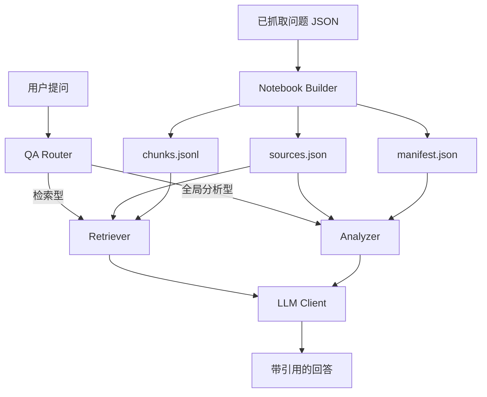

# ZhihuScraper NotebookLM 化实施方案

## 目标

把当前项目从“知乎抓取 + 离线归档”扩展成“知乎抓取 + NotebookLM 式资料问答工作台”。

产品目标：

- 先抓取一个知乎问题及全部回答
- 把该问题下的回答整理成一组可引用、可检索的资料
- 支持两类 AI 提问
  - 检索型问题：谁提到了什么、哪些回答支持什么
  - 全局分析型问题：整体倾向如何、主要分歧是什么、哪些回答最有代表性
- 返回结论时必须尽量附带引用来源，而不是只给一句抽象总结
- 缓存索引与中间分析结果，避免重复计算

## 一期边界

一期先做“单问题 notebook 化”的基础设施，不直接做完整 GUI。

一期范围：

- 把单个问题 JSON 转成 notebook 数据
- 生成 `sources` 与 `chunks`
- 保存到本地 `output/notebooks/<question_id>/`
- 提供问题类型路由
- 提供全局分析批次构建能力
- 提供检索型问答 prompt / 全局分析型 prompt 的统一骨架
- 为后续接入 DeepSeek/OpenAI/Gemini 留好接口

一期暂不做：

- 真正的在线 LLM 调用
- 真正的 embedding 向量索引
- GUI 问答面板
- 多问题/多资料集合并 notebook

## 总体架构



## 数据模型

### Source

一条回答作为一个来源单元。

建议字段：

- `question_id`
- `question_title`
- `answer_id`
- `author_name`
- `author_id`
- `upvote_count`
- `comment_count`
- `created_time`
- `updated_time`
- `content_text`
- `excerpt`
- `source_url`

### Chunk

一条长回答切成多个可检索文本块。

建议字段：

- `chunk_id`
- `question_id`
- `question_title`
- `answer_id`
- `author_name`
- `chunk_index`
- `text`
- `source_url`
- `upvote_count`
- `created_time`

### Citation

后续回答引用结构。

- `answer_id`
- `author_name`
- `source_url`
- `quote`
- `reason`

### Analysis Cache

后续全局分析中间产物。

- `question_id`
- `analysis_kind`
- `batch_index`
- `source_answer_ids`
- `result`
- `created_at`

## 两类问答路径

### A. 检索型问题

适用：

- 谁提到了土地财政？
- 哪些回答支持市场化？
- 哪些人反对延迟退休？

流程：

1. 识别问题为检索型
2. query 改写与清洗
3. 从 `chunks` 中召回候选片段
4. rerank 或简易排序
5. 组装引用上下文
6. 调用 LLM 生成答案
7. 返回答案 + citations

后续增强：

- embedding 检索
- 混合检索（BM25 + embedding）
- reranker

### B. 全局分析型问题

适用：

- 整体政治倾向如何？
- 哪几派观点最强？
- 谁的论证最完整？

流程：

1. 识别问题为全局分析型
2. 按回答数或字符数分批
3. 每批做结构化分析
4. 保存批次分析缓存
5. 汇总批次结果
6. 返回答案 + 代表性引用

后续增强：

- 快速模式：高赞 + 抽样
- 完整模式：全量分批
- 结构化标签缓存复用

## 成本控制策略

### 1. 先做程序级压缩

- 优先使用 `content_text`
- 过滤空回答或超短回答
- 每条回答限制分析输入长度
- 先按点赞排序，便于快速模式抽样

### 2. 批处理而不是逐条调用

不走“300 条回答 = 300 次模型调用”。

建议：

- 每批 15 到 20 条回答
- 300 条回答约 15 到 20 批
- 再做 1 次全局汇总

### 3. 两层缓存

第一层：资料缓存

- `sources.json`
- `chunks.jsonl`
- 后续 `embeddings.jsonl` 或索引文件

第二层：分析缓存

- 每批结构化分析结果
- 历史问题问答结果

### 4. 先做路由，再调用模型

先判断问题类型，不要把所有问题都当成需要全量分析。

### 5. 统一 prompt 前缀

为了后续接 DeepSeek 的前缀缓存，尽量固定：

- system prompt
- notebook 背景说明
- 输出格式要求

把变化放在最后的用户问题里。

## 目录设计

建议新增：

```text
docs/
  notebooklm-rag-plan.md

rag/
  __init__.py
  models.py
  chunker.py
  store.py
  prompts.py
  qa.py
  llm_client.py
  analyzer.py
  retriever.py
  indexer.py
```

一期真正实现：

- `models.py`
- `chunker.py`
- `store.py`
- `prompts.py`
- `qa.py`

二期再补：

- `llm_client.py`
- `retriever.py`
- `analyzer.py`
- `indexer.py`

## 一期数据流

1. 用户抓取问题
2. 读取问题 JSON
3. `chunker.py` 转成 `sources + chunks`
4. `store.py` 落盘到 `output/notebooks/<question_id>/`
5. `qa.py` 判断提问类型
6. 如果是全局分析型，构造分批分析计划
7. 如果是检索型，构造检索上下文计划
8. 后续由 `llm_client.py` 接模型 API

## 二期执行计划

### 阶段 1：数据层

- 完成 notebook 数据模型
- 完成 source/chunk 构建
- 完成本地 notebook 存储

完成标准：

- 任意问题 JSON 可转为 notebook
- notebook 能稳定落盘与读取

### 阶段 2：路由与 prompt

- 完成 query router
- 完成检索型/全局分析型 prompt 模板
- 完成全局分析批次规划

完成标准：

- 能正确区分两类问题
- 能输出待执行的分析计划

### 阶段 3：LLM 接入

- 接入 DeepSeek/OpenAI/Gemini 之一
- 跑通批次分析与汇总
- 跑通检索型问答

完成标准：

- 能对单个问题做 AI 问答
- 返回答案时带引用

### 阶段 4：GUI 接入

- 在问题页增加 AI 问答面板
- 增加“快速分析 / 完整分析”
- 展示引用来源和原始链接

完成标准：

- 用户无需命令行即可完成问答

## DeepSeek 接入建议

配置建议增加：

```env
DEEPSEEK_API_KEY=
DEEPSEEK_BASE_URL=https://api.deepseek.com
DEEPSEEK_MODEL=deepseek-chat
DEEPSEEK_REASONER_MODEL=
RAG_DEFAULT_BATCH_SIZE=18
RAG_CHUNK_TARGET_CHARS=900
RAG_CHUNK_OVERLAP_CHARS=120
```

建议：

- 先用 `deepseek-chat` 做一期文本问答
- 如果后续要更强全局分析，再评估更高推理成本模型

## 风险与注意点

- “政治倾向”“谁最聪明”这类问题本质带强主观性，回答时要附引用并提醒是基于文本归纳
- 单条回答非常长时，需要切块和截断，避免 token 暴涨
- 不能只做向量检索，否则全局问题效果会差
- 不做缓存会导致重复问题成本过高

## 当前已落地的实现目标

本轮开发优先完成以下基础能力：

- notebook 数据模型
- source/chunk 构建
- 本地存储
- 提问路由
- prompt 骨架
- 基础测试

这些能力完成后，后续接入真正的 LLM API 与 GUI 会顺很多。
